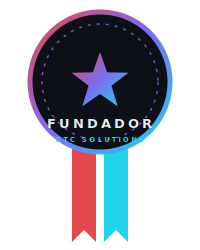

INGENIERO FULL-STACK &nbsp;·&nbsp; iOS &nbsp;·&nbsp; ANGULAR &nbsp;·&nbsp; AWS &nbsp;·&nbsp; IA APLICADA

---

**Software empresarial especializado** — centraliza, automatiza y crece. Integraciones omnicanal, automatización de procesos y analítica en tiempo real para empresas medianas. Entregado en semanas, no en meses.

---

## Sobre mí

Ingeniero **full-stack** que construye producto de punta a punta: del **iOS nativo (Swift)** y los **frontends** (Angular · Next.js + React 19) al **backend e infraestructura** (AWS · Django · Node · MongoDB). Me muevo entre la **arquitectura de producto**, la **IA aplicada** (visión, RAG, agentes de voz) y el detalle de UX que hace que algo se sienta terminado.

- Hoy construyo accesibilidad audio-first con Ray-Ban Meta y agentes de voz por teléfono (Platanus Hack 26).
- Trabajo en monorepos, organizo hubs por tecnología y dejo todo documentado.
- Con base en México; construyo para MX y LATAM.

---

## Stack

---

## Proyectos destacados

<table>
<tr><td width="50%" valign="top">

#### [MyEyesTalk · Puente](https://github.com/platanus-hack/platanus-hack-26-mx-team-5)

Accesibilidad audio-first sobre Ray-Ban Meta Gen 2: narración espacial, lista de compras y decisiones por voz para personas con discapacidad visual.

</td><td width="50%" valign="top">

#### [hackAIVoice](https://github.com/rlaaron/hackAIVoice)

Agente de voz por llamada: Twilio Media Streams puenteado con ElevenLabs Conversational AI e identidad por número.

</td></tr>
<tr><td width="50%" valign="top">

#### [Portafolio](https://joserauldev.qzz.io)

Next.js 16, React 19, Three.js, animaciones GSAP, cubo 3×3 de hubs por tecnología y auditoría de seguridad.

</td><td width="50%" valign="top">

#### Hackathons

HackMTY · Hack Morelos · Talent Land · Meta · TuFuturo. Organizador de **Hack Lobo** en la BUAP.

</td></tr>
</table>

---

## GitHub

---

